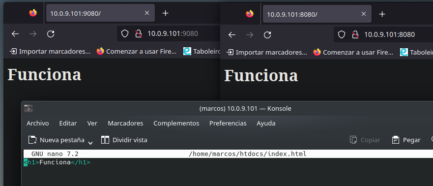
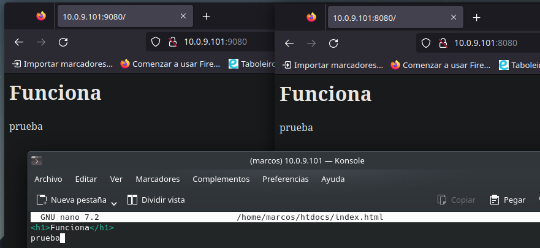

### Descarga la imagen 'httpd' y comprueba que está en tu equipo.
```sh
sudo docker image pull httpd
```
### Crea un contenedor con el nombre 'dam_web1'.
```sh
sudo docker run -p 8080:80 -v /home/marcos/htdocs:/usr/local/apache2/htdocs --name dam_web1 httpd
```
### Si quieres poder acceder desde el navegador de tu equipo, ¿que debes hacer?
Añadir un volumen al contenedor donde este el contenido y redirigir los puertos a los del servidor
#### Utiliza bind mount para que el directorio del apache2 'htdocs' esté montado un directorio que tu elijas.
```sh
sudo docker run -p 8080:80 -v /home/marcos/htdocs:/usr/local/apache2/htdocs --name dam_web1 httpd
```
### Realiza un 'hola mundo' en html y comprueba que accedes desde el navegador.
Si, funciona

### Crea otro contenedor 'dam_web2' con el mismo bind mount y a otro puerto, por ejemplo 9080.
```sh
sudo docker run -p 9080:80 -v /home/marcos/htdocs:/usr/local/apache2/htdocs --name dam_web2 httpd
```
### Comprueba que los dos servidores 'sirven' la misma página, es decir, cuando consultamos en el navegador:
> http://localhost:9080 
> http://localhost:8080

### Realiza modificaciones de la página y comprueba que los dos servidores 'sirven' la misma página

